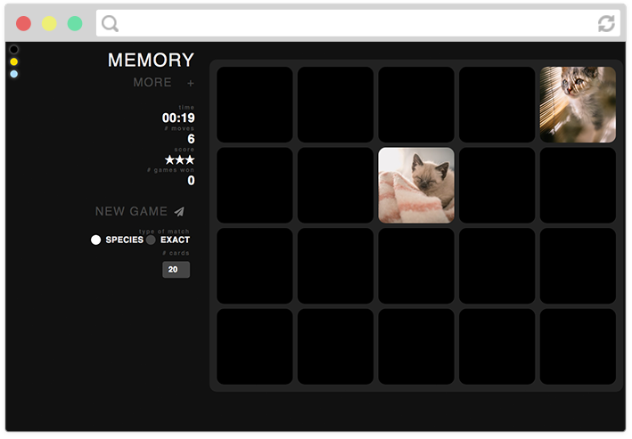
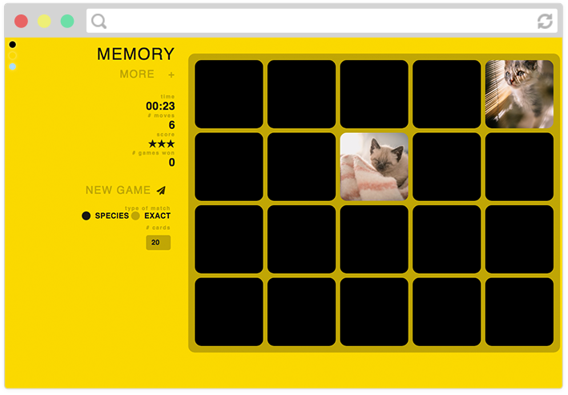
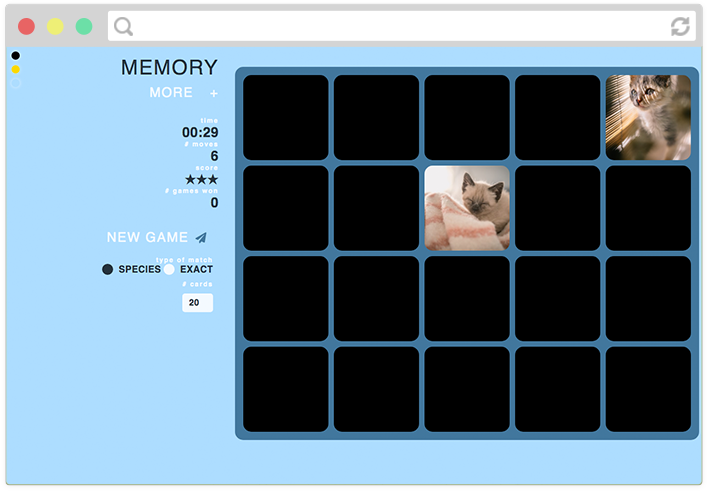
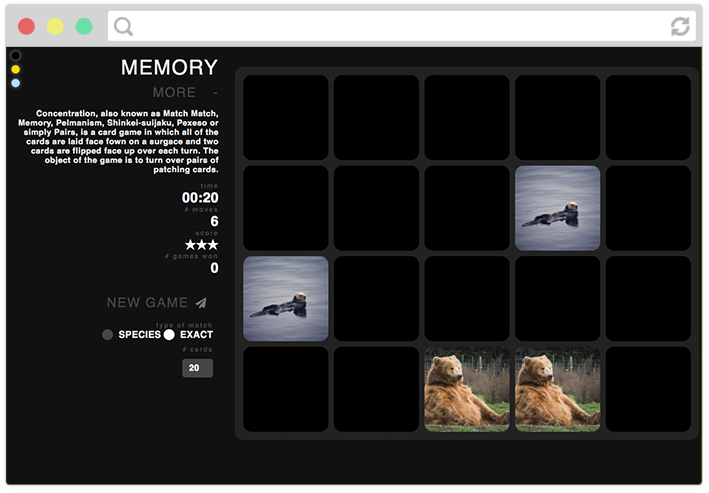

# Memory Game

## About

This is my memory game, click on any two cards to flip them around. If it's a match then they will stay flipped over, otherwise they will flip back. Once you have all the cards face up, you win!

Made with HTML/CSS, and Javascript.

## Features

- Cards on the board are randomly generated from a list, with special attention to make sure the randomisation between the different animal species is relatively even.
- Species mode:
	- The matches in this mode are made by species, but the images may be different
- Exact Match mode:
	- A match in this mode is only if the image is exactly the same.
- To track your score:
	- time
	- number of moves
	- star score (decreases based on the number of moves you have made, compared to the number of cards on the board for that game)
	- number of games won in that session
- You can select the number of cards you wish to be in the new game. This is rounded up to the nearest even number. It is a game of pairs after all.
- Colour palette in top left corner, allowing you to change the styling of the page at any time.

## Preview

You can find a demo of the site [here](https://lucyod10.github.io/Memory-Game/)

### Screenshots

## TODO

- fix grid of cards for all numbers and screen resolutions
- responsive for mobile.
- more colour templates
- colour template palette intersect with header on mobile
- back of cards match colour palette
